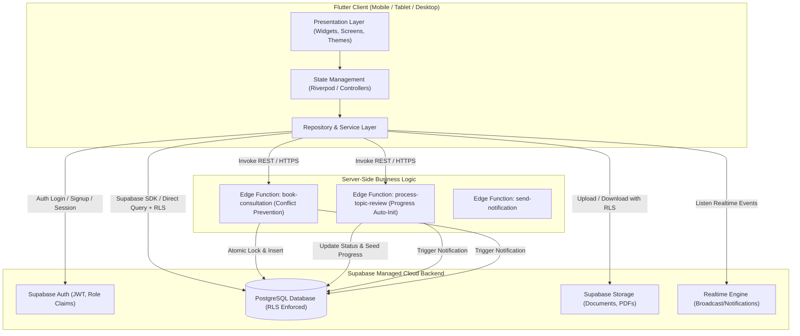

# SkripsiFlow — System Architecture

## 1. High-Level Architecture

SkripsiFlow menggunakan arsitektur *Client-Serverless Cloud-Native* berbasis **Flutter** dan **Supabase Platform**.

---

## 2. Layer & Responsibilities

### A. Presentation & Client Layer (Flutter)
- **Framework**: Flutter 3.x (Dart 3.x).
- **Target Platform**: Mobile (Android & iOS prioritaskan), responsif terhadap Tablet & Web/Desktop.
- **Tanggung Jawab**:
  - Render antarmuka bersih (*clean, minimalist, modern, academic*).
  - Validasi form interaktif (*client-side*).
  - Manajemen state lokal, caching, dan koneksi ke Supabase SDK.
  - Penanganan transisi rute berdasarkan status autentikasi dan role pengguna.

### B. Backend as a Service (Supabase)
- **Auth**: Mengelola user sign-in, token JWT, refresh token, dan claims role.
- **Database (PostgreSQL)**: Menyimpan semua data transaksional skripsi, profil pengguna, riwayat bimbingan, jadwal konsultasi, dan progress.
- **Row Level Security (RLS)**: Enforce hak akses data langsung di level database engine (zero trust client).
- **Storage**: Bucket terisolasi untuk file PDF pendukung pengajuan topik dan dokumen tahapan skripsi.
- **Realtime**: Menyalurkan event notifikasi secara instan saat dosen atau mahasiswa melakukan update.

### C. Server-Side Business Logic (Supabase Edge Functions)
- **Runtime**: Deno / TypeScript.
- **Tanggung Jawab**:
  - Menjalankan proses atomik yang rawan *race condition* (misal validasi bentrok jadwal konsultasi).
  - Mengotomasi efek samping status (contoh: pembuatan 8 tahapan `thesis_progress` saat topik disetujui).
  - Menjaga kredensial backend (Service Role Key) agar tidak pernah terekspos ke perangkat pengguna.
