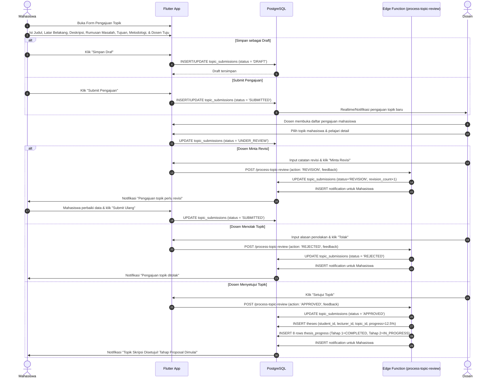
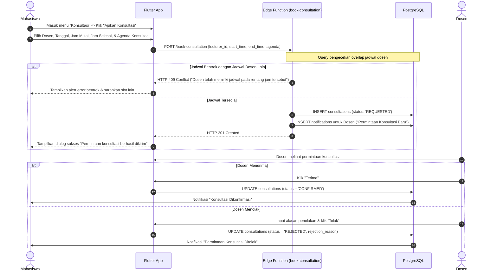
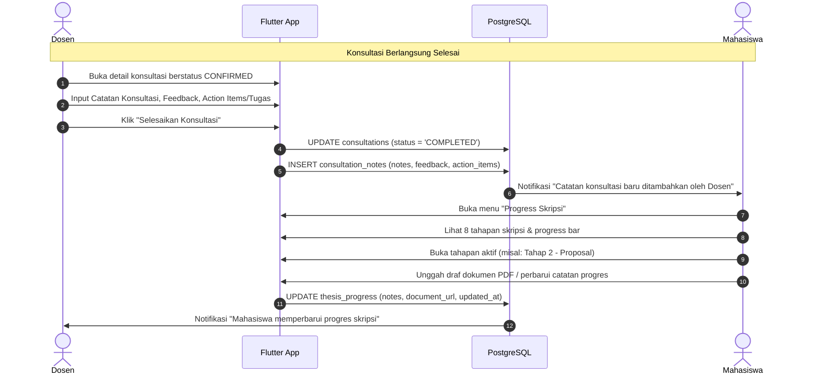

# SkripsiFlow — User Flows & Sequence Diagrams

Dokumen ini memuat diagram alur interaksi pengguna (Mahasiswa, Dosen, Admin) pada ketiga pilar fitur inti.

---

## 1. Fitur 1: Pengajuan & Review Topik Skripsi

Alur dari pembuatan draf oleh mahasiswa hingga review (persetujuan, revisi, penolakan) oleh dosen pembimbing:

---

## 2. Fitur 2: Pengajuan Jadwal Konsultasi (Anti-Bentrok)

Alur reservasi waktu konsultasi dengan validasi atomic bentrok jadwal di sisi server:

---

## 3. Fitur 2 (Lanjutan) & Fitur 3: Pasca-Konsultasi & Update Progress Skripsi

