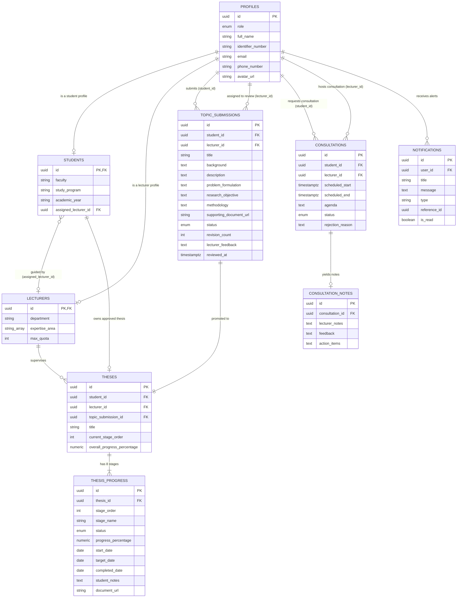

# SkripsiFlow — Entity Relationship Diagram (ERD)

Dokumen ini memodelkan struktur hubungan antar entitas di database **SkripsiFlow**.

---

## 1. ERD Diagram (Mermaid)

---

## 2. Deskripsi Kardinalitas Relasi

1. **`profiles` $\rightarrow$ `students` / `lecturers` (1 : 0..1)**:
   - Setiap baris profile yang memiliki `role = 'mahasiswa'` memiliki tepat 1 entri pada `students`.
   - Setiap baris profile yang memiliki `role = 'dosen'` memiliki tepat 1 entri pada `lecturers`.

2. **`students` $\rightarrow$ `lecturers` (N : 0..1)**:
   - Banyak mahasiswa dapat memiliki satu dosen pembimbing utama yang ditugaskan (`assigned_lecturer_id`).

3. **`students` $\rightarrow$ `topic_submissions` (1 : N)**:
   - Seorang mahasiswa dapat membuat beberapa riwayat pengajuan draf/topik, namun hanya 1 topik aktif yang dapat disetujui.

4. **`topic_submissions` $\rightarrow$ `theses` (1 : 1)**:
   - Topik yang disetujui (`status = 'APPROVED'`) menjadi basis pembentukan 1 record skripsi aktif.

5. **`theses` $\rightarrow$ `thesis_progress` (1 : 8)**:
   - Satu entitas skripsi selalu memiliki 8 record tahapan bimbingan berurutan (`stage_order = 1 s/d 8`).

6. **`consultations` $\rightarrow$ `consultation_notes` (1 : 0..1)**:
   - Konsultasi yang selesai dilaksanakan (`status = 'COMPLETED'`) menghasilkan 1 catatan konsultasi resmi dari dosen pembimbing.
