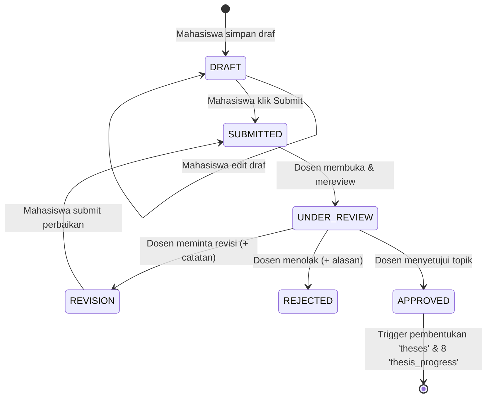
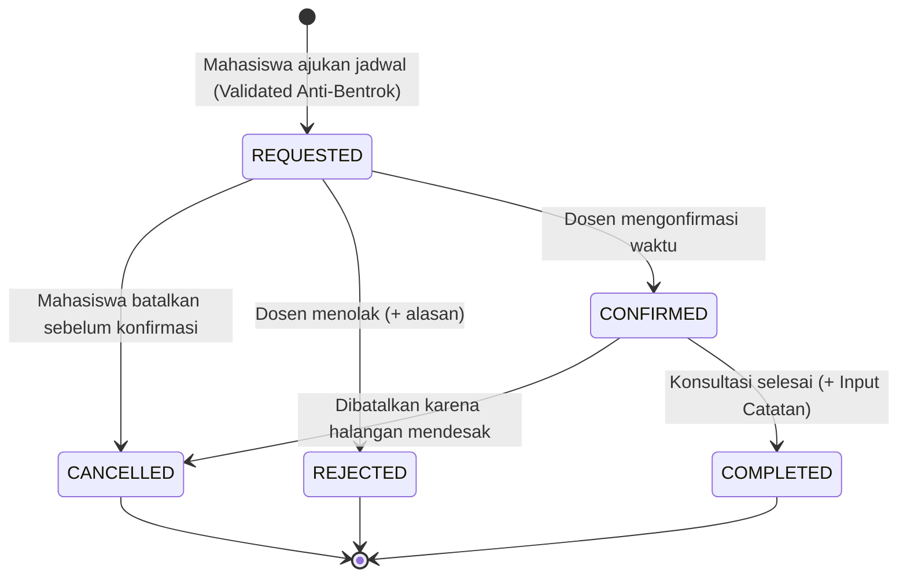

# SkripsiFlow — Status & State Transitions

Dokumen ini menjelaskan *state machine*, aturan transisi status, serta pemicu (*trigger*) otomatis pada ketiga modul utama: Pengajuan Topik, Jadwal Konsultasi, dan Monitoring Tahapan Skripsi.

---

## 1. Modul 1: Siklus Pengajuan Topik Skripsi

### State Transition Diagram

### Tabel Aturan Transisi Topik
| Status Awal | Aksi / Trigger | Status Baru | Pelaku | Efek Samping (Side Effects) |
| :--- | :--- | :--- | :--- | :--- |
| *None* | Simpan Form Awal | `DRAFT` | Mahasiswa | Record `topic_submissions` terbuat |
| `DRAFT` | Submit Pengajuan | `SUBMITTED` | Mahasiswa | Notifikasi terkirim ke Dosen |
| `SUBMITTED` | Mulai Review | `UNDER_REVIEW` | Dosen | Waktu `reviewed_at` dicatat |
| `UNDER_REVIEW` | Minta Revisi | `REVISION` | Dosen | `revision_count` + 1, notifikasi ke Mahasiswa |
| `REVISION` | Kirim Perbaikan | `SUBMITTED` | Mahasiswa | Status kembali `SUBMITTED`, notifikasi ke Dosen |
| `UNDER_REVIEW` | Tolak Topik | `REJECTED` | Dosen | Alasan tersimpan, notifikasi ke Mahasiswa |
| `UNDER_REVIEW` | Setujui Topik | `APPROVED` | Dosen | **Otomatis**: Inisialisasi entitas `theses` & 8 tahapan `thesis_progress` |

---

## 2. Modul 2: Siklus Jadwal Konsultasi

### State Transition Diagram

### Tabel Aturan Transisi Konsultasi
| Status Awal | Aksi / Trigger | Status Baru | Pelaku | Efek Samping |
| :--- | :--- | :--- | :--- | :--- |
| *None* | Booking Waktu Valid | `REQUESTED` | Mahasiswa | Slot terpesan, notifikasi ke Dosen |
| `REQUESTED` | Batalkan Permintaan | `CANCELLED` | Mahasiswa | Slot dibebaskan kembali |
| `REQUESTED` | Tolak Permintaan | `REJECTED` | Dosen | Simpan `rejection_reason`, notifikasi ke Mahasiswa |
| `REQUESTED` | Terima Permintaan | `CONFIRMED` | Dosen | Jadwal terkunci, notifikasi ke Mahasiswa |
| `CONFIRMED` | Selesaikan Pertemuan | `COMPLETED` | Dosen | Wajib input `consultation_notes`, notifikasi ke Mahasiswa |

---

## 3. Modul 3: Siklus 8 Tahapan Skripsi

Setiap skripsi memiliki 8 tahapan terstruktur dengan bobot progres kumulatif:

| No | Nama Tahapan Skripsi | Bobot Bobot | Status Awal Pasca-Approve | Syarat Penyelesaian |
| :--- | :--- | :--- | :--- | :--- |
| 1 | **Pengajuan Topik** | 12.5% | `COMPLETED` (100%) | Topik disetujui dosen |
| 2 | **Proposal Skripsi** | 25.0% | `IN_PROGRESS` (0%) | Dokumen proposal disetujui dosen |
| 3 | **Seminar Proposal (Sempro)** | 37.5% | `NOT_STARTED` (0%) | Berita Acara Sempro terunggah & valid |
| 4 | **Pengumpulan Data** | 50.0% | `NOT_STARTED` (0%) | Data penelitian terkumpul & divalidasi |
| 5 | **Analisis Data** | 62.5% | `NOT_STARTED` (0%) | Bab Analisis & Hasil selesai |
| 6 | **Penyusunan Naskah Skripsi** | 75.0% | `NOT_STARTED` (0%) | Draf naskah lengkap (Bab 1 s/d 5) disetujui |
| 7 | **Seminar Hasil (Semhas)** | 87.5% | `NOT_STARTED` (0%) | Semhas terlaksana & revisi selesai |
| 8 | **Sidang Akhir Skripsi** | 100.0% | `NOT_STARTED` (0%) | Ujian skripsi selesai & naskah final disahkan |

### Formula Progres Keseluruhan:
$$\text{Overall Progress} = \frac{\sum (\text{Progress Tahap } i \times 12.5\%)}{100\%}$$
Setiap kali satu tahapan berstatus `COMPLETED`, tahapan berikutnya otomatis berpindah dari `NOT_STARTED` ke `IN_PROGRESS`.
