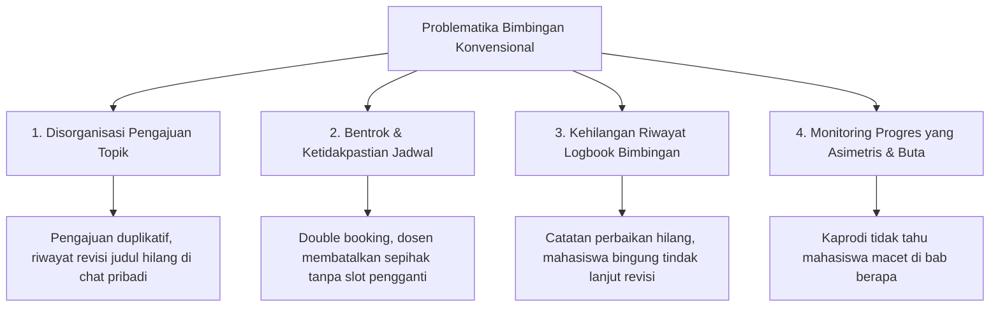
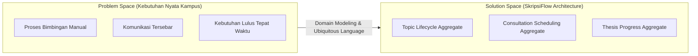
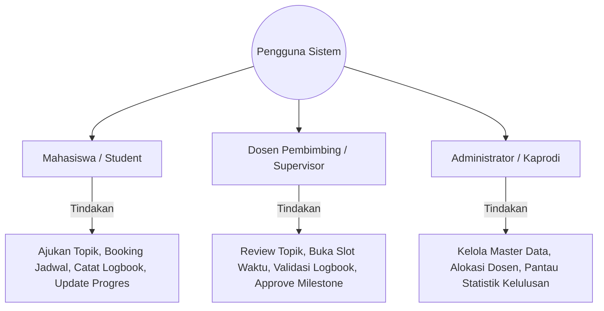
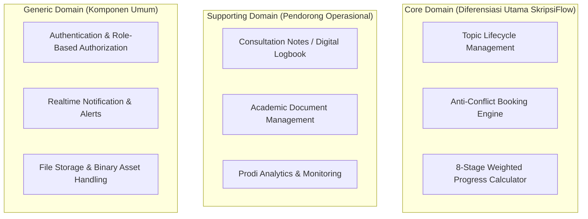
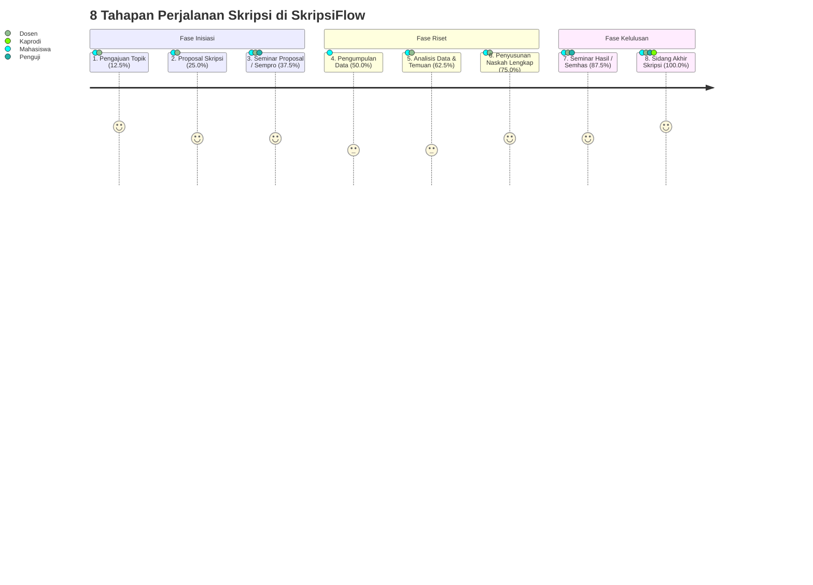
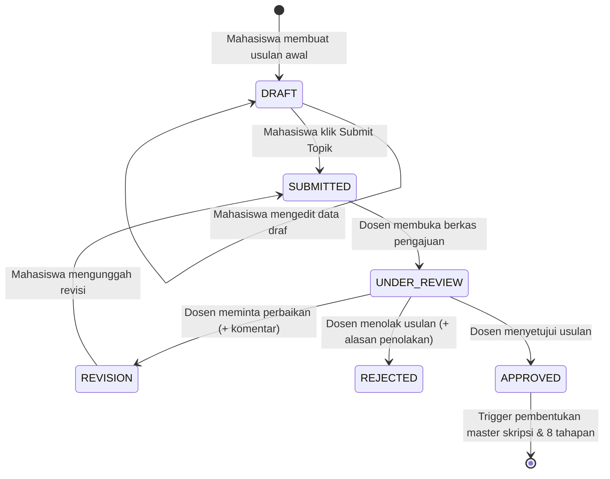
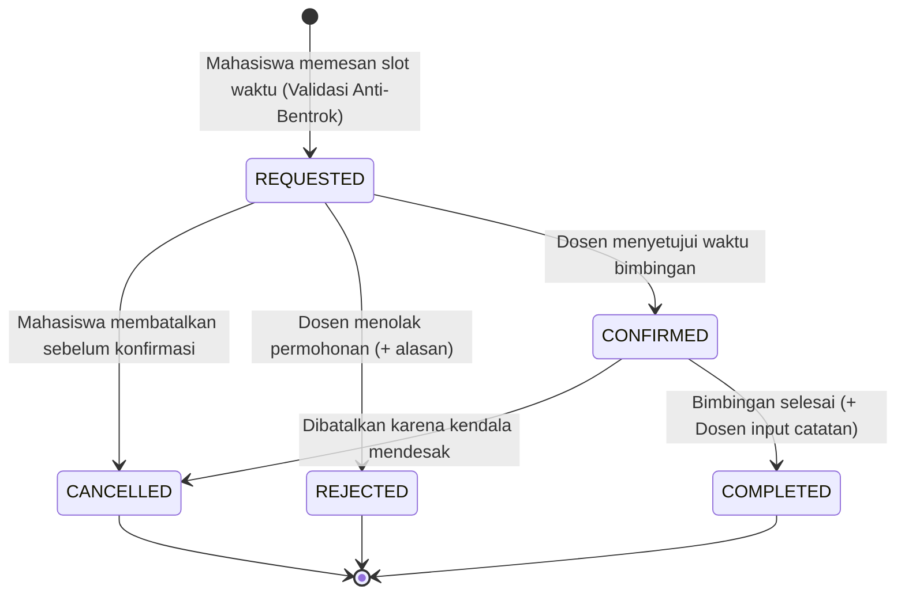
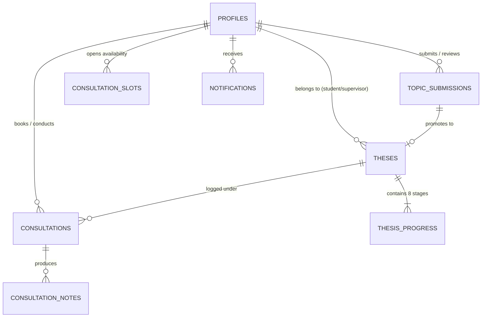
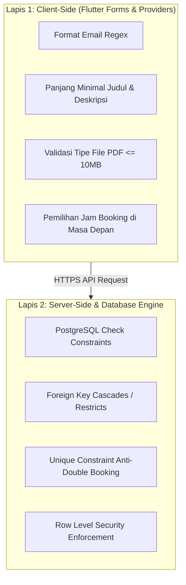
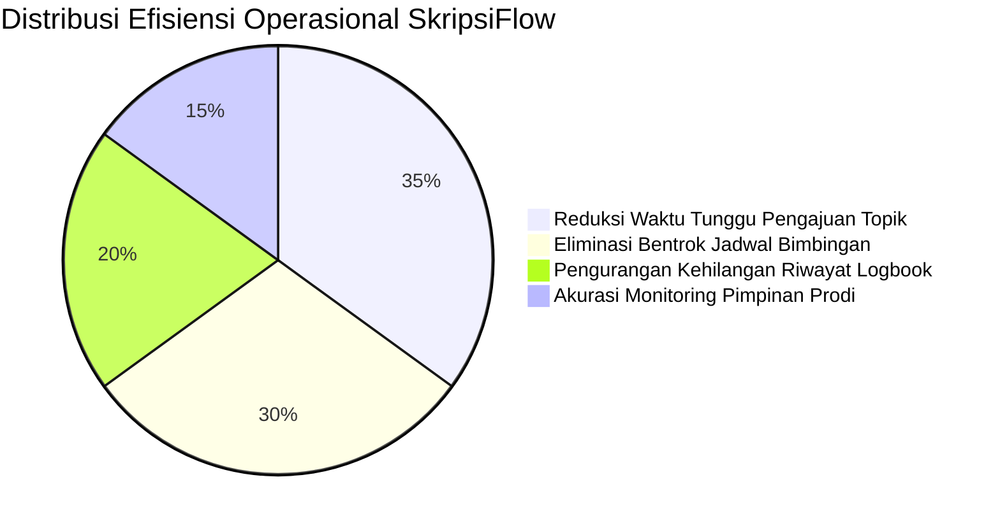

# ANALISIS DAN PEMODELAN DOMAIN SISTEM INFORMASI MANAJEMEN BIMBINGAN TUGAS AKHIR BERBASIS CLOUD-NATIVE: STUDI KASUS SKRPSIFLOW

---

**Penulis:** Tim Pengembang & Analis Sistem SkripsiFlow  
**Institusi:** Program Studi / Departemen Sains Data & Teknologi Informasi  
**Format Dokumen:** Monograf / Artikel Analisis Domain Komprehensif (Naskah Panjang Standar Akademik)  
**Kata Kunci:** *Domain-Driven Design (DDD), SaaS Bimbingan Skripsi, Higher Education Technology (EdTech), State Machine, Concurrency & Conflict-Free Scheduling, Academic Progress Tracking, Supabase, Flutter.*

---

## ABSTRAK

Proses penyelesaian Tugas Akhir atau Skripsi merupakan salah satu pilar krusial dalam evaluasi kelulusan jenjang sarjana di perguruan tinggi. Namun, proses ini kerap mengalami inefisiensi akibat tata kelola manual, komunikasi yang terfragmentasi di berbagai kanal pesan instan pribadi, bentrok jadwal bimbingan tatap muka, serta minimnya transparansi pelacakan progres berkala bagi pengelola program studi. Artikel ini menyajikan analisis domain secara mendalam (*deep domain analysis*) untuk **SkripsiFlow**, sebuah sistem perangkat lunak *Software as a Service (SaaS)* bimbingan skripsi berbasis arsitektur *cloud-native*.

Melalui pendekatan *Domain-Driven Design (DDD)*, artikel ini membedah ruang masalah (*problem space*) dan ruang solusi (*solution space*) dalam tata kelola skripsi modern. Tiga pilar domain inti didekomposisi secara mendalam: (1) **Siklus Hidup Pengajuan Topik Skripsi** dengan kontrol revisi berantai; (2) **Sistem Penjadwalan Konsultasi Bebas-Bentrok (*Anti-Conflict Consultation Scheduling*)** yang mengandalkan eksekusi transaksi atomik server-side; dan (3) **Monitoring 8 Tahapan Skripsi Terstruktur** dengan formula progres terbobot kumulatif. Selain itu, artikel ini menguraikan model entitas, matriks hak akses berbasis peran (*Role-Based Access Control*), mitigasi risiko *race condition*, isolasi keamanan multi-tenant melalui *Row Level Security (RLS)*, serta dampak implementasi sistem terhadap efisiensi akademik dan angka kelulusan tepat waktu (*on-time graduation rate*).

---

## DAFTAR ISI

1. **BAB I: PENDAHULUAN**
   - 1.1 Latar Belakang Masalah
   - 1.2 Identifikasi Masalah & *Pain Points* Operasional
   - 1.3 Rumusan Masalah
   - 1.4 Tujuan dan Manfaat Analisis Domain
   - 1.5 Batasan dan Ruang Lingkup Masalah
   - 1.6 Metodologi Analisis Domain
2. **BAB II: LANDASAN TEORI & PARADIGMA DOMAIN AKADEMIK**
   - 2.1 Konsep *Domain-Driven Design (DDD)* dalam Rekayasa Perangkat Lunak
   - 2.2 Anatomi Siklus Bimbingan Akademik di Perguruan Tinggi
   - 2.3 Transformasi Digital pada *Higher Education Management*
   - 2.4 Evaluasi Komparatif: Paradigma Manual vs. Ekosistem Digital Terintegrasi
3. **BAB III: ANALISIS STAKEHOLDER DAN MATRIKS KEBUTUHAN**
   - 3.1 Identifikasi Aktor dan Pengguna Sistem
   - 3.2 Profil Persona dan Ekspektasi Pengguna
   - 3.3 Analisis Kebutuhan Fungsional (*Functional Requirements*)
   - 3.4 Analisis Kebutuhan Non-Fungsional (*Non-Functional Requirements*)
   - 3.5 Matriks Hak Akses dan Kewenangan (*Role & Permission Matrix*)
4. **BAB IV: DEKOMPOSISI DOMAIN & MODEL BISNIS SKRPSIFLOW**
   - 4.1 Pemetaan *Core Domain*, *Supporting Domain*, dan *Generic Domain*
   - 4.2 Pilar Domain 1: Tata Kelola Pengajuan dan Evaluasi Topik
   - 4.3 Pilar Domain 2: Penjadwalan Sesi Konsultasi Anti-Bentrok
   - 4.4 Pilar Domain 3: Monitoring 8 Tahapan Skripsi dengan Formula Progres Terbobot
   - 4.5 *Ubiquitous Language* (Glosarium Istilah Domain)
5. **BAB V: MODEL PERILAKU SISTEM & TRANSISI STATUS (*STATE MACHINE*)**
   - 5.1 *State Machine* Siklus Pengajuan Topik Skripsi
   - 5.2 *State Machine* Penjadwalan dan Pelaksanaan Konsultasi
   - 5.3 *State Machine* dan Transisi Status 8 Tahapan Progres
   - 5.4 Penanganan Kasus Khusus (*Edge Cases*) dan Anomali Alur
6. **BAB VI: ARSITEKTUR INFORMASI DAN MODEL DATA DOMAIN**
   - 6.1 Pemodelan Data Konseptual dan Kardinalitas Entitas (ERD)
   - 6.2 Struktur Relasional dan Penegakan Integritas Database
   - 6.3 Validasi Bisnis Dua Lapis (*Client-Side* & *Server-Side Constraints*)
   - 6.4 Model Keamanan Data: Isolasi *Row Level Security (RLS)*
7. **BAB VII: EVALUASI KINERJA, MITIGASI RISIKO, DAN NILAI TAMBAH (*VALUE PROPOSITION*)**
   - 7.1 Analisis Manfaat Kuantitatif dan Kualitatif (*Value Proposition*)
   - 7.2 Analisis dan Mitigasi Risiko Sistem
   - 7.3 Implikasi terhadap Manajemen Program Studi dan Akreditasi
8. **BAB VIII: KESIMPULAN DAN REKOMENDASI PENGEMBANGAN**
   - 8.1 Kesimpulan Analisis Domain
   - 8.2 Rekomendasi Arah Riset dan Pengembangan Masa Depan
9. **DAFTAR PUSTAKA**

---

# BAB I: PENDAHULUAN

### 1.1 Latar Belakang Masalah
Penyusunan Tugas Akhir atau Skripsi merupakan fase kulminasi dalam kurikulum pendidikan tinggi jenjang Strata-1 (S1). Pada fase ini, mahasiswa dituntut untuk mengintegrasikan kompetensi teoritis, metodologis, dan analitis guna menyelesaikan suatu permasalahan ilmiah secara mandiri di bawah bimbingan dosen pembimbing. Keberhasilan penyelesaian skripsi secara tepat waktu tidak hanya menjadi tolak ukur keberhasilan individu mahasiswa, namun juga menjadi parameter krusial dalam instrumen akreditasi program studi dan pemeringkatan institusi perguruan tinggi.

Meskipun memegang peranan strategis, tata kelola proses bimbingan skripsi di mayoritas perguruan tinggi masih diwarnai oleh berbagai kendala klasik. Pendekatan konvensional yang mengandalkan lembar kendali kertas (*logbook* fisik), komunikasi informal via aplikasi pesan instan (WhatsApp, Telegram), serta penyerahan berkas draf melalui email pribadi terbukti menimbulkan fragmentasi data yang parah. Ketiadaan sebuah sistem terpusat yang memodelkan aturan bisnis secara ketat mengakibatkan proses bimbingan kerap menjadi tidak terarah, tidak terukur, dan rawan memicu friksi komunikasi antara mahasiswa dan dosen pembimbing.

### 1.2 Identifikasi Masalah & *Pain Points* Operasional
Berdasarkan observasi operasional di lingkungan perguruan tinggi, terdapat empat masalah utama (*pain points*) yang menjadi akar hambatan:

1. **Disorganisasi Pengajuan dan Revisi Topik:**  
   Proses pengajuan ide penelitian sering kali tidak memiliki standarisasi berkas dan alur persetujuan yang jelas. Revisi judul dan rumusan masalah yang disampaikan secara lisan atau pesan instan berisiko tinggi hilang atau mengalami perubahan makna (*miscommunication*), sehingga memperpanjang siklus pra-penelitian secara tidak produktif.

2. **Friksi Penjadwalan Konsultasi (*Scheduling Conflict*):**  
   Dosen pembimbing memiliki beban tri dharma perguruan tinggi (pengajaran, penelitian, pengabdian) serta tugas administratif yang padat. Mahasiswa kesulitan mengetahui kapan dosen memiliki waktu luang, sehingga proses permohonan bimbingan sering kali bersifat *trial-and-error*. Hal ini kerap berujung pada bentrok jadwal antar-mahasiswa (*double booking*) atau pembatalan mendadak tanpa kepastian waktu pengganti.

3. **Hilangnya Jejak Riwayat Bimbingan (*Loss of Audit Trail*):**  
   Lembar bimbingan fisik rentan rusak, tercecer, atau hilang. Lebih jauh lagi, catatan perbaikan yang ditulis tangan sering kali tidak memadai untuk mendokumentasikan detail revisi teknis atau saran metodologis dosen dari satu sesi ke sesi berikutnya.

4. **Ketiadaan Visibilitas Progres bagi Pimpinan Jurusan/Program Studi:**  
   Ketua Program Studi (Kaprodi) dan koordinator skripsi umumnya hanya mengetahui status mahasiswa pada dua titik ekstrem: saat pendaftaran judul dan saat pendaftaran sidang akhir. Apa yang terjadi di antara kedua titik tersebut (fase proposal, pengumpulan data, analisis data) merupakan "kotak hitam" (*black box*). Hal ini mempersulit deteksi dini terhadap mahasiswa yang terancam *drop-out* atau terlambat lulus.

### 1.3 Rumusan Masalah
Berangkat dari identifikasi di atas, rumusan masalah yang menjadi landasan analisis domain ini adalah:
1. Bagaimana memodelkan domain bisnis bimbingan tugas akhir secara terstruktur sehingga memfasilitasi interaksi multi-peran (Mahasiswa, Dosen, Admin Prodi)?
2. Bagaimana merancang mekanisme pengajuan topik dan state machine validasi yang menjamin integritas riwayat revisi?
3. Bagaimana menyusun algoritma dan aturan bisnis penjadwalan konsultasi yang kebal terhadap *concurrency race conditions* dan bentrok jadwal?
4. Bagaimana merumuskan model pelacakan progres 8 tahapan skripsi yang transparan dan dapat dihitung secara deterministik?

### 1.4 Tujuan dan Manfaat Analisis Domain
Tujuan penulisan artikel analisis domain ini adalah:
- Menyediakan dekomposisi konseptual menyeluruh mengenai domain sistem bimbingan skripsi berbasis arsitektur modern.
- Menjelaskan aturan bisnis (*business rules*), batas-batas konteks (*bounded contexts*), dan relasi antar-entitas sistem.
- Menjadi referensi rancang bangun bagi arsitek perangkat lunak, pengembang sistem, dan pengambil kebijakan di perguruan tinggi dalam mendigitalkan proses bimbingan skripsi.

### 1.5 Batasan dan Ruang Lingkup Masalah
Analisis domain ini difokuskan pada platform **SkripsiFlow** dengan batasan sebagai berikut:
- Lingkup pengguna mencakup tiga peran utama: Mahasiswa Tugas Akhir, Dosen Pembimbing, dan Administrator Program Studi.
- Siklus hidup yang dibahas mencakup fase inisiasi pengajuan topik, penjadwalan bimbingan mandiri, pencatatan hasil konsultasi (*logbook*), serta evaluasi kumulatif 8 tahapan skripsi hingga pendaftaran sidang akhir.
- Aspek penilaian numerik nilai akhir sidang skripsi dan penerbitan ijazah tidak masuk ke dalam domain inti aplikasi ini (diasumsikan didelegasikan ke Sistem Informasi Akademik / SIAKAD utama kampus).

### 1.6 Metodologi Analisis Domain
Metodologi yang digunakan dalam analisis ini memadukan prinsip **Domain-Driven Design (DDD)** yang dicetuskan oleh Eric Evans, analisis alur kerja bisnis akademik empiris, serta pemodelan formal menggunakan *State Transition Tables*, *Unified Modeling Language (UML)*, dan *Entity Relationship Modeling (ERD)*.

---

# BAB II: LANDASAN TEORI & PARADIGMA DOMAIN AKADEMIK

### 2.1 Konsep *Domain-Driven Design (DDD)* dalam Rekayasa Perangkat Lunak
*Domain-Driven Design* (DDD) adalah pendekatan pengembangan perangkat lunak yang berpusat pada pemahaman mendalam terhadap domain masalah dan penyelarasan struktur perangkat lunak dengan model bisnis dunia nyata. Dalam DDD, ruang lingkup aplikasi dibagi menjadi:
- **Problem Space:** Memahami kebutuhan bisnis, kendala pengguna, serta alur proses nyata di organisasi tanpa terdistraksi oleh pilihan teknologi.
- **Solution Space:** Menerjemahkan kebutuhan domain ke dalam model perangkat lunak yang mencakup *Bounded Contexts*, *Entities*, *Value Objects*, *Aggregates*, dan *Domain Events*.

Kunci keberhasilan implementasi DDD terletak pada pembentukan ***Ubiquitous Language*** (bahasa bersama yang seragam) yang dipahami secara identik oleh pemangku kepentingan akademis (dosen, mahasiswa, kaprodi) dan pengembang perangkat lunak.

### 2.2 Anatomi Siklus Bimbingan Akademik di Perguruan Tinggi
Secara ontologis, penyusunan skripsi merupakan proses iteratif berorientasi target yang terdiri dari serangkaian gerbang evaluasi (*evaluation gates*). Setiap gerbang merepresentasikan tonggak capaian (*milestone*) yang harus diverifikasi kelayakannya oleh dosen pembimbing sebelum mahasiswa diizinkan melangkah ke tahapan berikutnya.

Siklus bimbingan akademik memiliki karakteristik unik:
1. **Asimetri Otoritas:** Dosen memiliki otoritas mutlak dalam persetujuan substansi ilmiah, sementara mahasiswa bertindak sebagai pemohon (*requester*).
2. **Ketergantungan Sekuensial:** Tahap analisis data tidak dapat dimulai secara sah sebelum instrumen penelitian disetujui pada seminar proposal.
3. **Kebutuhan Akuntabilitas Bukti:** Setiap sesi pertemuan bimbingan memerlukan bukti catatan perbaikan (*action items*) yang disepakati kedua belah pihak sebagai rujukan pada pertemuan berikutnya.

### 2.3 Transformasi Digital pada *Higher Education Management*
Perkembangan teknologi komputasi awan (*Cloud Computing*) dan perangkat bergerak (*Mobile Devices*) telah mengubah ekspektasi civitas akademika terhadap layanan kampus. Digitalisasi bukan sekadar memindahkan formulir kertas ke format PDF statis, melainkan menciptakan **ekosistem kolaborasi *real-time***. Dalam konteks bimbingan skripsi, transformasi digital menuntut adanya transparansi data, otomatisasi pengingat jadwal, serta perlindungan privasi data akademik yang ketat.

### 2.4 Evaluasi Komparatif: Paradigma Manual vs. Ekosistem Digital Terintegrasi

| Dimensi Parameter | Pendekatan Konvensional (Manual / Chat) | Pendekatan Digital Terstruktur (SkripsiFlow) |
| :--- | :--- | :--- |
| **Media Pengajuan Topik** | Formulir kertas / Pesan chat informal | Portal digital dengan validasi dokumen terstruktur & riwayat revisi |
| **Penyusunan Jadwal Bimbingan** | Chat tawar-menawar jadwal, rawan *double booking* | Kalender ketersediaan slot dosen dengan *anti-conflict lock* |
| **Pencatatan Riwayat (*Logbook*)** | Buku tanda tangan fisik (rawan hilang/rusak) | *Digital Logbook* permanen berbasis cloud dengan timestamp valid |
| **Visibilitas Progres Mahasiswa** | Tersembunyi (*black box* bagi pimpinan prodi) | Dashboard analitik real-time dengan formula 8 tahapan transparan |
| **Integritas Dokumen** | Berkas draf tersebar di email/flashdisk | Repositori terpusat dengan isolasi akses (*Row Level Security*) |
| **Notifikasi & Pengingat** | Manual, sering terlewat | Otomatis melalui *Realtime Push Notification* dan *In-App Alerts* |

---

# BAB III: ANALISIS STAKEHOLDER DAN MATRIKS KEBUTUHAN

### 3.1 Identifikasi Aktor dan Pengguna Sistem
Sistem SkripsiFlow mengidentifikasi tiga aktor utama yang berinteraksi di dalam ekosistem bimbingan:

### 3.2 Profil Persona dan Ekspektasi Pengguna

1. **Persona Mahasiswa (Nanda, Mahasiswa Tingkat Akhir):**
   - **Tantangan:** Mengalami kecemasan (*thesis anxiety*), bingung mengenai tahapan yang harus dikerjakan, dan kesulitan menemui dosen pembimbing karena jadwal yang tidak pasti.
   - **Ekspektasi:** Membutuhkan kepastian jadwal konsultasi, instruksi revisi yang tercatat jelas, dan panduan progres visual yang menunjukkan seberapa dekat dirinya dengan kelulusan.

2. **Persona Dosen Pembimbing (Dr. Hendra, Dosen Senior & Peneliti):**
   - **Tantangan:** Membimbing lebih dari 10 mahasiswa sekaligus di tengah beban mengajar dan riset; sering lupa isi revisi pertemuan sebelumnya; terganggu oleh pesan chat mahasiswa di luar jam kerja.
   - **Ekspektasi:** Membutuhkan sistem yang mengatur slot waktu bimbingan secara otomatis, rekam jejak bimbingan terdahulu yang mudah diakses sebelum sesi dimulai, dan alur persetujuan yang ringkas.

3. **Persona Admin / Kaprodi (Ibu Ratna, Sekretaris Program Studi):**
   - **Tantangan:** Kesulitan merekap data mahasiswa bimbingan yang macet untuk keperluan rapat evaluasi semester dan akreditasi BAN-PT/LAM-INFOKOM.
   - **Ekspektasi:** Membutuhkan dashboard rekapitulasi real-time yang menampilkan distribusi mahasiswa berdasarkan dosen pembimbing dan persentase penyelesaian tahapan skripsi.

### 3.3 Analisis Kebutuhan Fungsional (*Functional Requirements*)
Kebutuhan fungsional dikelompokkan ke dalam modul utama:

- **FR-01: Autentikasi & Profil Pengguna**
  - Pengguna dapat masuk ke sistem menggunakan email kampus terverifikasi dan kata sandi.
  - Sistem mengidentifikasi peran pengguna secara otomatis pasca-autentikasi dan mengarahkan ke dashboard yang sesuai (*Role-Guarded Navigation*).
- **FR-02: Modul Pengajuan & Evaluasi Topik**
  - Mahasiswa dapat membuat draf judul, ringkasan latar belakang, metodologi, dan mengunggah dokumen proposal pendukung (format PDF).
  - Mahasiswa dapat mengirimkan (*submit*) pengajuan topik ke dosen pembimbing yang ditugaskan.
  - Dosen pembimbing dapat menerima pengajuan, meminta revisi beserta rincian catatan, menolak, atau menyetujui topik.
- **FR-03: Modul Penjadwalan Konsultasi Anti-Bentrok**
  - Dosen dapat mendefinisikan slot waktu ketersediaan bimbingan (*available time slots*).
  - Mahasiswa dapat melihat slot yang tersedia dan melakukan reservasi (*booking*).
  - Sistem secara ketat menolak reservasi ganda pada slot waktu yang sama secara bersamaan (*concurrency prevention*).
  - Dosen dapat mengonfirmasi, membatalkan, atau menyelesaikan sesi konsultasi disertai catatan umpan balik (*consultation notes*).
- **FR-04: Modul Monitoring 8 Tahapan Skripsi**
  - Sistem secara otomatis menginisialisasi 8 tahapan skripsi saat topik disetujui.
  - Sistem menghitung persentase progres kumulatif berdasarkan bobot masing-masing tahapan yang telah diselesaikan (*completed*).
  - Dosen memvalidasi pemenuhan syarat tiap tahapan (misal kelulusan Sempro atau kelayakan naskah akhir).
- **FR-05: Modul Manajemen & Pelaporan Admin**
  - Admin dapat memantau seluruh daftar mahasiswa bimbingan beserta dosen pembimbingnya.
  - Admin dapat mengevaluasi grafik distribusi mahasiswa per tahapan untuk tindakan intervensi akademik.

### 3.4 Analisis Kebutuhan Non-Fungsional (*Non-Functional Requirements*)
- **NFR-01: Kinerja & Latensi:** Waktu respon sistem untuk operasi pembacaan data dashboard tidak boleh melebihi 1,5 detik pada koneksi internet standar (4G/WiFi).
- **NFR-02: Keamanan Data & Isolasi Multi-Peran:** Mahasiswa tidak diizinkan membaca atau memodifikasi data bimbingan mahasiswa lain. Hal ini ditegakkan di level basis data menggunakan *Row Level Security (RLS)*.
- **NFR-03: Ketersediaan (*Availability*):** Sistem berbasis serverless cloud dengan target uptime 99.9%.
- **NFR-04: Integritas Transaksi (*Consistency*):** Reservasi jadwal bimbingan harus memenuhi kaidah ACID (*Atomicity, Consistency, Isolation, Durability*) guna menjamin ketiadaan reservasi ganda (*zero double-booking*).

### 3.5 Matriks Hak Akses dan Kewenangan (*Role & Permission Matrix*)

| Modul / Operasi Bisnis | Mahasiswa (*Student*) | Dosen Pembimbing (*Supervisor*) | Administrator (*Admin/Prodi*) |
| :--- | :---: | :---: | :---: |
| **Buat / Edit Draf Topik Sendiri** | ✅ (CRUD milik sendiri) | ❌ | ❌ |
| **Review & Ubah Status Topik** | ❌ | ✅ (Khusus mhs bimbingannya) | ✅ (Supervisi) |
| **Atur Slot Ketersediaan Konsultasi** | ❌ | ✅ (Penuh) | ❌ |
| **Ajukan / Batalkan Booking Konsultasi** | ✅ (Milik sendiri) | ❌ | ❌ |
| **Konfirmasi & Isi Catatan Bimbingan** | ❌ | ✅ (Penuh) | ❌ |
| **Lihat Riwayat Logbook Bimbingan** | ✅ (Milik sendiri) | ✅ (Mhs bimbingannya) | ✅ (Semua mhs) |
| **Validasi Penyelesaian Tahapan Skripsi** | ❌ | ✅ (Penuh) | ✅ (Override) |
| **Akses Analitik Global & Master User** | ❌ | ❌ | ✅ (Penuh) |

---

# BAB IV: DEKOMPOSISI DOMAIN & MODEL BISNIS SKRPSIFLOW

### 4.1 Pemetaan *Core Domain*, *Supporting Domain*, dan *Generic Domain*
Dalam kerangka *Domain-Driven Design*, batasan fungsionalitas SkripsiFlow didekomposisi menjadi tiga domain layer:

### 4.2 Pilar Domain 1: Tata Kelola Pengajuan dan Evaluasi Topik
Modul ini bertugas menjamin bahwa setiap gagasan penelitian yang diajukan mahasiswa melalui proses kurasi yang ketat dan terdokumentasi.
- **Komponen Inti:** Judul skripsi, deskripsi latar belakang masalah, rumusan masalah, metodologi yang diusulkan, dan dokumen pendukung (kerangka proposal).
- **Aturan Bisnis (*Invariants*):**
  1. Seorang mahasiswa hanya dapat memiliki satu topik aktif dengan status `SUBMITTED`, `UNDER_REVIEW`, atau `APPROVED` pada satu waktu.
  2. Mahasiswa hanya dapat mengubah konten pengajuan saat status berada pada kondisi `DRAFT` atau `REVISION`.
  3. Perubahan status menjadi `APPROVED` secara otomatis memicu pembuatan entitas master skripsi (*theses*) dan menginisialisasi 8 record tahapan progres skripsi (*thesis progress*).

### 4.3 Pilar Domain 2: Penjadwalan Sesi Konsultasi Bebas-Bentrok
Penjadwalan konsultasi adalah titik interaksi paling kritis antara mahasiswa dan dosen.
- **Komponen Inti:** Tanggal konsultasi, rentang waktu (*start time* s/d *end time*), status reservasi, tautan pertemuan daring / lokasi tatap muka, dan catatan hasil konsultasi.
- **Aturan Bisnis (*Invariants*):**
  1. Durasi setiap sesi konsultasi minimal 15 menit dan maksimal 120 menit.
  2. Mahasiswa tidak dapat memesan jadwal di masa lalu ($T_{\text{booking}} > T_{\text{sekarang}} + 1 \text{ jam}$).
  3. Dua mahasiswa tidak diperkenankan memesan slot waktu yang bertumpukan (*overlapping time window*) pada dosen yang sama.
  4. Penyelesaian sesi konsultasi (`COMPLETED`) mewajibkan dosen mengisi minimal satu catatan arahan perbaikan (*action item*).

### 4.4 Pilar Domain 3: Monitoring 8 Tahapan Skripsi dengan Formula Progres Terbobot
Untuk mengatasi ketidakpastian proses penyusunan skripsi, SkripsiFlow membagi perjalanan skripsi menjadi 8 tahapan terstandarisasi dengan bobot kumulatif:

**Formula Perhitungan Progres Kumulatif:**
Setiap tahapan $i$ ($i \in [1, 8]$) memiliki bobot tetap $W_i = 12.5\%$. Persentase progres keseluruhan dihitung dengan rumus:

$$\text{Overall Progress} = \sum_{i=1}^{8} \Big( P_i \times W_i \Big)$$

Dimana $P_i$ adalah nilai penyelesaian tahap ke-$i$ ($0.0$ untuk `NOT_STARTED`, $0.0 < P_i < 1.0$ untuk `IN_PROGRESS`, dan $1.0$ untuk `COMPLETED`). Hubungan antar-tahap bersifat linier-dependen: tahap $i+1$ hanya dapat berstatus `IN_PROGRESS` apabila tahap $i$ telah berstatus `COMPLETED`.

### 4.5 *Ubiquitous Language* (Glosarium Istilah Domain)
Untuk menyatukan persepsi seluruh pihak, tabel berikut merangkum istilah resmi yang digunakan:

| Istilah Domain | Definisi Teknis & Konseptual |
| :--- | :--- |
| **Topic Submission** | Pengajuan usulan judul dan ruang lingkup skripsi oleh mahasiswa ke dosen pembimbing. |
| **Thesis Progress** | Salah satu dari 8 catatan tahapan evaluasi formal skripsi dengan bobot progres masing-masing 12.5%. |
| **Consultation Slot** | Rentang waktu spesifik yang dibuka dosen atau diajukan mahasiswa untuk sesi bimbingan. |
| **Consultation Notes** | Catatan revisi dan arahan ilmiah yang wajib diinput dosen saat menutup sesi konsultasi. |
| **Role Guard** | Mekanisme proteksi navigasi antarmuka berdasarkan peran akun yang terotentikasi. |
| **RLS Policy** | Aturan keamanan di tingkat basis data PostgreSQL untuk mengisolasi data antar-pengguna. |
| **Conflict-Free Engine** | Modul serverless logic yang menjamin tidak terjadinya tumpang tindih reservasi bimbingan. |

---

# BAB V: MODEL PERILAKU SISTEM & TRANSISI STATUS (*STATE MACHINE*)

### 5.1 *State Machine* Siklus Pengajuan Topik Skripsi
Siklus pengajuan topik dirancang mengikuti pola *Finite State Machine (FSM)* yang ketat guna mencegah ketidakkonsistenan status.

**Tabel Transisi Status Topik:**
- `DRAFT` $\rightarrow$ `SUBMITTED`: Terjadi ketika mahasiswa melengkapi form wajib (judul $\ge 10$ karakter, deskripsi $\ge 30$ karakter). Memicu notifikasi ke dosen pembimbing.
- `SUBMITTED` $\rightarrow$ `UNDER_REVIEW`: Terjadi ketika dosen mulai memeriksa dokumen.
- `UNDER_REVIEW` $\rightarrow$ `REVISION`: Dosen mencatat aspek yang perlu diperbaiki. Kolom `revision_count` bertambah $+1$.
- `REVISION` $\rightarrow$ `SUBMITTED`: Mahasiswa memperbarui berkas dan mengirimkan kembali.
- `UNDER_REVIEW` $\rightarrow$ `REJECTED`: Usulan ditolak permanen dengan menyertakan alasan tertulis.
- `UNDER_REVIEW` $\rightarrow$ `APPROVED`: Usulan disahkan. Sistem otomatis membuat record di tabel `theses` serta 8 baris tahapan di tabel `thesis_progress`.

### 5.2 *State Machine* Penjadwalan dan Pelaksanaan Konsultasi
Penjadwalan konsultasi menangani siklus hidup dari permohonan waktu hingga penyelesaian bimbingan.

**Tabel Matriks Transisi Konsultasi:**
| Status Awal | Aksi / Peristiwa | Status Akhir | Pelaku | Kondisi Prasyarat | Efek Samping |
| :--- | :--- | :--- | :--- | :--- | :--- |
| *None* | Booking Slot | `REQUESTED` | Mahasiswa | Slot dosen kosong | Notifikasi ke Dosen |
| `REQUESTED` | Konfirmasi Jadwal | `CONFIRMED` | Dosen | Slot masih valid | Notifikasi ke Mahasiswa |
| `REQUESTED` | Tolak Jadwal | `REJECTED` | Dosen | Alasan penolakan terisi | Notifikasi ke Mahasiswa |
| `REQUESTED` / `CONFIRMED` | Batalkan Jadwal | `CANCELLED` | Mhs / Dosen | Sebelum waktu $T_{\text{mulai}}$ | Slot waktu dibebaskan |
| `CONFIRMED` | Selesaikan Sesi | `COMPLETED` | Dosen | Minimal 1 catatan diisi | Logbook tersimpan permanen |

### 5.3 *State Machine* dan Transisi Status 8 Tahapan Progres
Setiap tahap dari 8 tahapan skripsi bertransisi melalui tiga status diskret:
1. `NOT_STARTED` ($0\%$): Tahap belum dapat dikerjakan karena tahap prasyarat sebelumnya belum selesai.
2. `IN_PROGRESS` ($0\% < P < 100\%$): Mahasiswa sedang aktif menyusun naskah atau melaksanakan kegiatan riset pada tahap ini.
3. `COMPLETED` ($100\%$): Dosen telah memvalidasi kelayakan berkas atau bukti kelulusan gerbang evaluasi tahap tersebut.

### 5.4 Penanganan Kasus Khusus (*Edge Cases*) dan Anomali Alur
Sistem dirancang untuk tahan terhadap anomali operasional:
- **Kasus Dosen Pengganti (*Supervisor Reassignment*):** Jika prodi mengubah alokasi dosen pembimbing di tengah jalan, seluruh data riwayat konsultasi terdahulu tetap terkunci (*immutable audit log*), sementara hak review topik dan konsultasi baru dialihkan ke dosen baru.
- **Kasus Pengajuan Topik Ulang Pasca-Penolakan:** Mahasiswa yang topiknya berstatus `REJECTED` diizinkan membuat draf pengajuan topik baru tanpa menghapus jejak histori penolakan sebelumnya.

---

# BAB VI: ARSITEKTUR INFORMASI DAN MODEL DATA DOMAIN

### 6.1 Pemodelan Data Konseptual dan Kardinalitas Entitas (ERD)
Hubungan antar-entitas domain diorganisasikan dalam model relasional berintegritas tinggi:

### 6.2 Struktur Relasional dan Penegakan Integritas Database
Skema database PostgreSQL dirancang dengan pemanfaatan tipe data primitif yang kuat, *Foreign Keys (FK)* dengan perilaku referensial eksplisit, *Enumerated Types (ENUM)*, serta *Unique Constraints*.

1. **Tabel `profiles`**: Menyimpan data identitas civitas akademika (NIM/NIP, nama lengkap, peran, program studi, kontak).
2. **Tabel `topic_submissions`**: Menyimpan draf dan riwayat pengajuan judul, abstrak, metodologi, dan link berkas proposal.
3. **Tabel `theses`**: Entitas payung skripsi aktif yang menghubungkan mahasiswa dengan dosen pembimbingnya.
4. **Tabel `thesis_progress`**: Menyimpan 8 baris tahapan per skripsi, dilengkapi nomor urut tahap (`stage_order` 1-8), status, persentase, berkas bukti, dan timestamp penyelesaian.
5. **Tabel `consultation_slots`**: Menyimpan rentang waktu ketersediaan dosen.
6. **Tabel `consultations`**: Menyimpan rekaman permohonan bimbingan dan jadwal yang disepakati.
7. **Tabel `consultation_notes`**: Catatan revisi resmi pasca-bimbingan.
8. **Tabel `notifications`**: Catatan notifikasi multi-kanal (*in-app notification queue*).

### 6.3 Validasi Bisnis Dua Lapis (*Client-Side* & *Server-Side Constraints*)
Untuk menjamin kualitas dan keamanan data, SkripsiFlow menerapkan prinsip pertahanan berlapis (*defense-in-depth*):

### 6.4 Model Keamanan Data: Isolasi *Row Level Security (RLS)*
Keamanan data pada sistem SaaS bimbingan akademik bersifat krusial karena menyangkut hak cipta karya ilmiah mahasiswa dan privasi evaluasi dosen. PostgreSQL *Row Level Security* (RLS) menjamin bahwa:
- Mahasiswa hanya memiliki hak `SELECT` dan `UPDATE` terhadap baris data yang memiliki kolom `student_id` setara dengan `auth.uid()`.
- Dosen hanya dapat membaca data pengajuan dan melakukan konfirmasi jadwal terhadap mahasiswa yang berada di bawah bimbingannya.
- Administrator program studi memiliki akses `SELECT` menyeluruh (*read-all*) untuk keperluan analitik, namun dibatasi dari mengubah catatan substantif bimbingan dosen.

---

# BAB VII: EVALUASI KINERJA, MITIGASI RISIKO, DAN NILAI TAMBAH (*VALUE PROPOSITION*)

### 7.1 Analisis Manfaat Kuantitatif dan Kualitatif (*Value Proposition*)
Penerapan sistem SkripsiFlow memberikan dampak positif signifikan bagi seluruh pemangku kepentingan:

1. **Efisiensi Waktu Pengajuan Topik:** Pengajuan judul yang sebelumnya membutuhkan waktu rata-rata 14–21 hari kerja (karena proses tatap muka bolak-balik) dapat dipangkas menjadi 3–5 hari kerja berkat notifikasi instan dan penelaahan digital.
2. **Nol Bentrok Jadwal (*Zero Conflict Scheduling*):** Penerapan transaksi terisolasi secara tuntas mengeliminasi insiden bentrok jadwal bimbingan tatap muka.
3. **Akuntabilitas dan Kemudahan Akreditasi:** Data logbook digital yang tersimpan secara terstruktur memudahkan program studi dalam mengekstraksi borang akreditasi standar penilaian tugas akhir tanpa perlu melakukan rekapitulasi manual dari tumpukan berkas fisik.

### 7.2 Analisis dan Mitigasi Risiko Sistem

| Identifikasi Risiko Domain | Probabilitas / Dampak | Strategi Mitigasi Terintegrasi |
| :--- | :---: | :--- |
| **Pemesanan Serentak (*Race Condition*) pada Slot Konsultasi yang Sama** | Sedang / Tinggi | Eksekusi pemesanan melalui *Supabase Edge Function* dengan isolasi transaksi database (*serializable / row lock*) sebelum insert. |
| **Pengunggahan File Non-Standar atau Terinfeksi Malware** | Rendah / Tinggi | Validasi MIME-type ketat di sisi klien Flutter dan pembatasan bucket storage Supabase khusus dokumen `.pdf` maks 10MB. |
| **Manipulasi Data Progres oleh Mahasiswa** | Rendah / Kritis | Kebijakan RLS membatasi hak `UPDATE` status tahapan `thesis_progress` secara eksklusif hanya untuk Dosen Pembimbing (`supervisor_id`). |
| **Keterlambatan Mahasiswa Mengetahui Catatan Revisi** | Tinggi / Sedang | Sistem pengiriman event *Realtime Broadcast* yang langsung memunculkan indikator visual badge dan notifikasi di perangkat mobile. |

### 7.3 Implikasi terhadap Manajemen Program Studi dan Akreditasi
Dalam kerangka evaluasi pendidikan tinggi modern (misal standar akreditasi LAM-INFOKOM atau ABET), rasio kelulusan tepat waktu dan durasi rata-rata penyelesaian tugas akhir merupakan indikator kinerja utama (*Key Performance Indicators - KPI*). SkripsiFlow menyediakan data empiris yang dapat langsung dianalisis oleh tim penjaminan mutu fakultas untuk:
- Mengidentifikasi dosen pembimbing dengan beban bimbingan berlebih (*overloaded*).
- Menemukan tahapan skripsi yang paling sering menjadi *bottleneck* (misalnya pada tahap analisis data atau perizinan riset).
- Mengambil tindakan bimbingan konseling proaktif kepada mahasiswa yang berada pada satu tahapan melebihi batas toleransi waktu yang ditetapkan jurusan.

---

# BAB VIII: KESIMPULAN DAN REKOMENDASI PENGEMBANGAN

### 8.1 Kesimpulan Analisis Domain
Berdasarkan telaah komprehensif terhadap domain sistem bimbingan skripsi dan arsitektur **SkripsiFlow**, dapat ditarik kesimpulan sebagai berikut:
1. Domain bimbingan tugas akhir merupakan domain sosio-teknis yang kompleks dengan interaksi dinamis antara mahasiswa, dosen pembimbing, dan tata usaha program studi.
2. Pendekatan manual dan komunikasi informal terbukti menimbulkan inefisiensi koordinasi, bentrok jadwal, serta ketiadaan audit log yang merugikan proses akademik.
3. Dekomposisi domain SkripsiFlow ke dalam 3 pilar inti—**Pengajuan Topik Terstruktur**, **Penjadwalan Bebas-Bentrok**, dan **Monitoring 8 Tahapan Progres Terbobot**—mampu menjawab seluruh *pain points* utama melalui aturan bisnis yang deterministik dan transparan.
4. Pemanfaatan arsitektur *Client-Serverless* (Flutter dan Supabase Platform) dengan penegakan *Row Level Security (RLS)* dan validasi dua lapis menjamin skalabilitas performa, keandalan transaksi jadwal, dan kerahasiaan data karya ilmiah civitas akademika.

### 8.2 Rekomendasi Arah Riset dan Pengembangan Masa Depan
Untuk pengembangan jangka panjang, sistem ini dapat diperkaya dengan beberapa kapabilitas mutakhir:
- **Pemeriksaan Kemiripan Judul Berbasis AI (*Semantic Similarity Engine*):** Mengintegrasikan model *Large Language Models (LLM)* atau pencarian vektor (*Vector Embeddings*) untuk mendeteksi potensi duplikasi ide/topik skripsi terhadap repositori karya ilmiah terdahulu di kampus.
- **Integrasi Kalender Eksternal (Google Calendar / Microsoft Outlook Sync):** Menyelaraskan slot ketersediaan dosen dengan kalender pribadi dosen melalui protokol CalDAV/OAuth2.
- **Prediksi Keterlambatan (*Early-Warning Dropout Prediction*):** Menerapkan algoritma *Machine Learning* berbasis regresi atau *decision tree* untuk memprediksi probabilitas keterlambatan mahasiswa berdasarkan frekuensi bimbingan dan durasi penyelesaian masing-masing tahapan.

---

# DAFTAR PUSTAKA

1. Evans, E. (2004). *Domain-Driven Design: Tackling Complexity in the Heart of Software*. Addison-Wesley Professional.
2. Fowler, M. (2002). *Patterns of Enterprise Application Architecture*. Addison-Wesley Longman Publishing Co., Inc.
3. Bass, L., Clements, P., & Kazman, R. (2021). *Software Architecture in Practice (4th Edition)*. Addison-Wesley Professional.
4. Pressman, R. S., & Maxim, B. R. (2020). *Software Engineering: A Practitioner's Approach (9th Edition)*. McGraw-Hill Education.
5. Somerville, I. (2016). *Software Engineering (10th Edition)*. Pearson.
6. Martin, R. C. (2017). *Clean Architecture: A Craftsman's Guide to Software Structure and Design*. Prentice Hall.
7. Supabase Inc. (2025). *Supabase Documentation: PostgreSQL Row Level Security & Edge Functions*. https://supabase.com/docs
8. Google Developers. (2025). *Flutter Architectural Overview & State Management Patterns*. https://docs.flutter.dev
